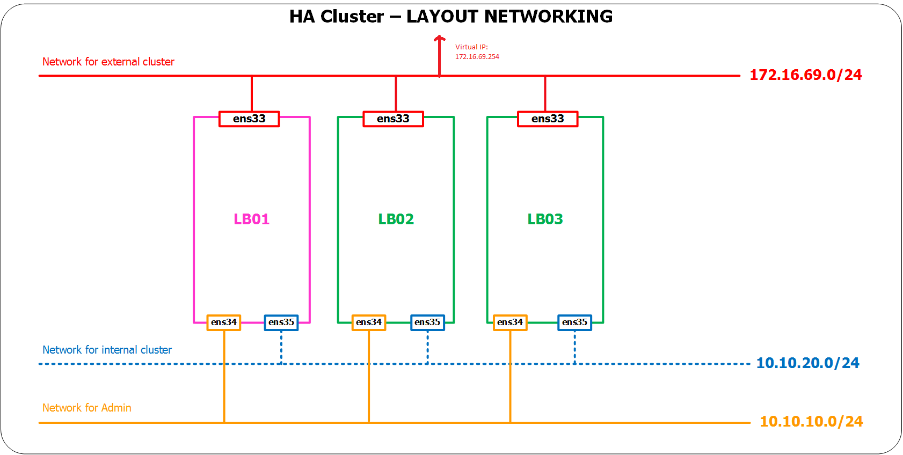
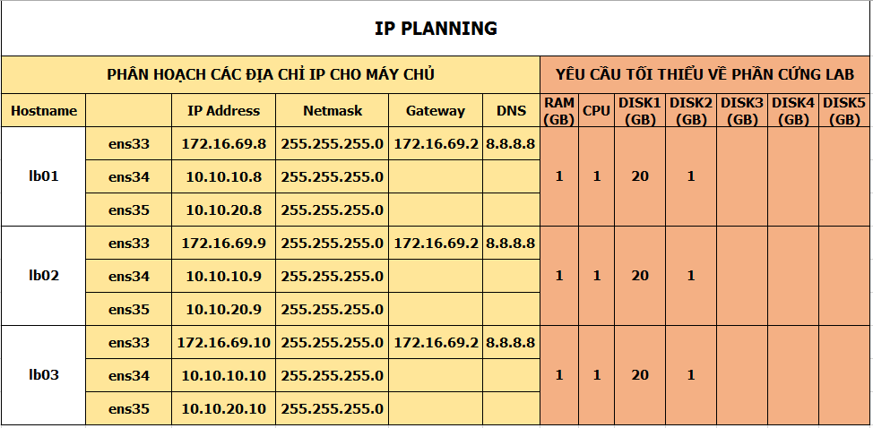

# 1. Sao chép dữ liệu lưu trữ sử dụng DRBD - Distributed Replicated Block Device kết hợp sử dụng Pacemaker.

____

# Mục lục

- [1.1 Yêu cầu giải quyết bài toán](#issue)
- [1.2 Mô hình triển khai và các yêu cầu](#models)
- [1.3 Tiến hành cài đặt](#install)
    - [1.3.1 Cài đặt httpd - Web Server](#httpd)
    - [1.3.2 Tạo, format ổ đĩa cho việc đồng bộ dữ liệu](#format)
    - [1.3.3 Cài đặt DRBD và cấu hình](#install-drbd)
    - [1.3.4 Cài đặt pacemaker và corosync](#install-pcsd)
    - [1.3.5 Tạo cluster, thêm các resource và ràng buộc sử dụng pacemaker](#pcsd-resource)
- [1.4 Kiểm tra kết quả](#test)
- [Các nội dung khác](#content-others)

____

# <a name="content">Nội dung</a>

- ### <a name="issue">1.1 Yêu cầu giải quyết bài toán</a>

    - DRBD được sử dụng để nâng cao hiệu suất khi sử dụng các hệ thống HA để phục vụ việc chia sẻ, đồng bộ dữ liệu giữa các node trong cluster. Nhắm tránh trường hợp khi có một node đang cung cấp các dịch vụ bỗng nhiên dừng hoạt động và toàn bộ các dữ liệu liên quan đến dịch vụ bị mất đi có thể được giữ lại toàn vẹn và cho phép các dịch vụ có thể được tiếp tục sử dụng lại ngay sau đó.

- ### <a name="models">1.2 Mô hình triển khai và các yêu cầu</a>

    - Mô hình triển khai được cho theo hình dưới đây:

        

    - Địa chỉ IP cho các node các yêu cầu về phần cứng:

        

    - Hệ điều hành sử dụng trên các node: Centos 7
    - Trên tất cả các node, ta cần disable service firewalld. Sử dụng câu lệnh sau để disable:

            systemctl stop firewalld
            systemctl disable firewalld

    - Các node được cấu hình DNS trong file /etc/hosts. Bằng cách chạy câu lệnh sau:

            echo "10.10.10.8    lb01" >> /etc/hosts
            echo "10.10.10.9    lb02" >> /etc/hosts
            echo "10.10.10.10    lb03" >> /etc/hosts

- ### <a name="install">1.3 Tiến hành cài đặt</a>
    - ### <a name="httpd">1.3.1 Cài đặt httpd - Web Server</a>

        - Để cài đặt httpd - Web Server, ta thực hiện chạy câu lệnh sau trên cả 3 node:

                yum install -y httpd*

    - ### <a name="format">1.3.2 Tạo, format ổ đĩa cho việc đồng bộ dữ liệu</a>

        - Để tạo ra một LVM disk để chia sẻ, đồng bộ dữ liệu, trên cả 3 node, ta thực hiện các câu lệnh sau:

                pvcreate /dev/sdb

            kết quả:

                 Physical volume "/dev/sdb" successfully created

            tiếp tục chạy lệnh:

                vgcreate vgdrbd /dev/sdb

            kết quả ta được:

                 Volume group "vgdrbd" successfully created

            cuối cùng chạy lệnh sau để hoàn tất bước này:

                lvcreate -n vol1 -l100%FREE vgdrbd

            kết quả tương tự như sau:

                Logical volume "vol1" created.

    - ### <a name="install-drbd">1.3.3 Cài đặt DRBD và cấu hình</a>

        - Để cài đặt DRBD trên Centos 7, ta thực hiện chạy lần lượt các câu lệnh sau trên cả 3 node;

            + Thêm signing key của ELRepo package:

                    rpm --import https://www.elrepo.org/RPM-GPG-KEY-elrepo.org

            + Enable ELRepo repository:

                    rpm -Uvh http://www.elrepo.org/elrepo-release-7.0-2.el7.elrepo.noarch.rpm

            + Cuối cùng, ta chạy lệnh sau để cài đặt DRBD và kernel modules:

                    yum install -y kmod-drbd84 drbd84-utils

                đối với các phiên bản của drbd84-utils trên Centos 7, nó đang tồn tại một lỗi khi tích hợp DRBD với Pacemaker trong quá trình tạo resource để quản lý DRBD. Để khắc phục lỗi này, ta cần chạy câu lệnh sau để download script của DRBD sử dụng cho việc tích hợp vào Pacemaker:

                    curl -o /usr/lib/ocf/resource.d/linbit/drbd 'http://git.linbit.com/gitweb.cgi?p=drbd-utils.git;a=blob_plain;f=scripts/drbd.ocf;h=cf6b966341377a993d1bf5f585a5b9fe72eaa5f2;hb=c11ba026bbbbc647b8112543df142f2185cb4b4b'

        - Thực hiện restart lại cả 3 node, rồi sau đó ta chạy 2 câu lệnh sau để kiểm tra kết quả cài đặt đã thành công hay chưa trên cả 3 node:

                modprobe drbd
                lsmod | grep drbd

            kết quả được như sau:

                drbd                  405309  0
                libcrc32c              12644  2 xfs,drbd

        - Tiếp theo, ta sẽ thực hiện cấu hình DRBD cho phép phần mềm có thể biết được thông tin và disk mà nó sẽ đảm nhiệm chức năng đồng bộ, backup. Trên cả 3 node, ta thực hiện chạy câu lệnh sau:

                vi /etc/drbd.d/testdata1.res

            sau đó thêm nội dung dưới đây vào và lưu lại:

                resource testdata1 {
                    protocol C;        
                    on lb01 {
                        device /dev/drbd0;
                        disk /dev/vgdrbd/vol1;
                        address 10.10.10.8:7788;
                        meta-disk internal;
                    }
                    on lb02 {
                        device /dev/drbd0;
                        disk /dev/vgdrbd/vol1;
                        address 10.10.10.9:7788;
                        meta-disk internal;
                    }
                    on lb03 {
                        device /dev/drbd0;
                        disk /dev/vgdrbd/vol1;
                        address 10.10.10.10:7788;
                        meta-disk internal;
                    }
                }

            trong đó:
                
                - testdata1: là tên của resource DRBD
                - Protocol C: giao thức nhân bản phổ biến. Các thao tác ghi cục bộ trên node chính được coi là hoàn thành ngay sau khi việc ghi dữ liệu trên local disk và remote disk (disk trên các node còn lại) đã được xác nhận.
                - on lb01, on lb02, .. : Chỉ tên các node, có thể có trong file cấu hình hoặc không.
                - device /dev/drbd0: Quy định tên logical volume trên các node. (drbd0 chính là tên của logical volume)
                - disk /dev/vgdrbd/vol1: Quy định disk dành riêng cho sao lưu dữ liệu
                - address 10.10.10.9:7788: Quy định địa chỉ IP của mỗi node, 7788 là port mặc định kết nối các host trong DRBD cluster.
                
        - Trên cả 3 node, ta thực hiện chạy câu lệnh sau để khởi tạo DRBD storage và sau đó có thể khởi chạy cùng hệ thống:

                drbdadm create-md testdata1
                
                systemctl start drbd
                systemctl enable drbd

        - Tiếp theo, ta sẽ thực hiện chạy câu lệnh sau để quy định xem node nào đóng vai trò chính trong việc quản lý dữ liệu. Giả sử ta chọn node lb01, trên node lb01 ta sẽ thực hiện chạy câu lệnh:

                drbdadm primary testdata1 --force

        - Trên node lb01, ta thực hiện tạo một file hệ thống và gán nó với disk volume, tạo file `index.html` để kiểm tra kết quả:

                mkfs.ext3 /dev/drbd0
                mount /dev/drbd0 /mnt
                echo "Welcome to World" > /mnt/index.html
                umount /mnt

    - ### <a name="install-pcsd">1.3.4 Cài đặt pacemaker và corosync</a>

        - Để cài đặt pacemaker và corosync, ta thực hiện chạy câu lệnh sau trên cả 3 node. Bạn có thể xem hướng dẫn chi tiết cho mô hình 3 node tại [1. Cài đặt pacemaker](pcmk-pacemaker-corosync-installing.md#pacemaker) (Bạn chỉ cần thực hiện đến bước tạo ra một resource Virtual_IP.)

    - ### <a name="pcsd-resource">1.3.5 Tạo cluster, thêm các resource và ràng buộc sử dụng pacemaker</a>

        - Sau khi đã tạo ra resource Virtual_IP, ta sẽ tạo ra resource Httpd để quản lý Web Server bằng việc chạy câu lệnh sau trên node lb01:

                pcs resource create Httpd ocf:heartbeat:apache configfile=/etc/httpd/conf/httpd.conf op monitor interval=1min
        
            thêm các ràng buộc cho resource Httpd này:

                pcs constraint colocation add Httpd with Virtual_IP INFINITY
                pcs constraint order Virtual_IP then Httpd

        - Tiếp theo, ta sẽ tích hợp DRBD resource vào cluster. Các câu lệnh sau sẽ chạy trên node lb01:

            Config CIB drbd_cfg:

                pcs cluster cib drbd_cfg

            Tạo resource:

                pcs -f drbd_cfg resource create DrbdData ocf:linbit:drbd drbd_resource=testdata1 op monitor interval=60s

            Tạo ra một clone resource:

                pcs -f drbd_cfg resource master DrbdDataClone DrbdData master-max=1 master-node-max=1 clone-max=3 clone-node-max=2 notify=true

            Update CIB:

                pcs cluster cib-push drbd_cfg

        - Cuối cùng, ta sẽ tạo ra DRBD filesystem resource. Chạy các câu lệnh sau cũng trên node lb01:

            Config CIB fs_cfg:

                pcs cluster cib fs_cfg

            Tạo resource:

                pcs  -f fs_cfg resource create DrbdFS Filesystem device="/dev/drbd0" directory="/var/www/html" fstype="ext3"

            Thiết lập các ràng buộc:

                pcs  -f fs_cfg constraint colocation add DrbdFS with DrbdDataClone INFINITY with-rsc-role=Master
                pcs  -f fs_cfg constraint order promote DrbdDataClone then start DrbdFS
                pcs -f fs_cfg constraint colocation add Httpd with DrbdFS INFINITY
                pcs -f fs_cfg constraint order DrbdFS then Httpd

            Update thay đổi CIB:

                pcs cluster cib-push fs_cfg

- ### <a name="test">1.4 Kiểm tra kết quả</a>

    - Trên node lb01, ta thực hiện khởi động lại resource Virtual_IP để các resource hoạt động một cách ổn định bằng việc sử dụng 2 câu lệnh sau:

            pcs resource disable Virtual_IP
            pcs resource enable Virtual_IP

        nếu có lỗi phát sinh, ta thực hiện chạy câu lệnh sau rồi chạy 2 câu lệnh trên:

            pcs resource cleanup

    - Để kiểm tra kết quả cho việc đồng bộ, ta làm như sau:

        - Bước 1. Kiểm tra thư mục `/var/www/html` trên node lb01, lb02, lb03. So sánh sự khác nhau giữa chúng:
        - Bước 2. Mở trình duyệt, truy cập tới địa chỉ: http://172.16.69.254 để xem nội dung
        - Bước 3. Tắt node lb01 - node mà đang có Virtual_IP resource chạy trên đó. Sau đó lặp lại bước 2.
        - Bước 4. Trên node có resource đang chạy, ta thực hiện kiểm tra thư mục `/var/www/html` và nhận thấy file `index.html` đã được xuất hiện trên node này. Trong khi ban đầu, ta không thấy nó. Chứng tỏ, việc triển khai đã thành công

        
# Tham khảo:

    - [Integrate DRBD with pacemaker clusters - learnitguide.net](http://www.learnitguide.net/2016/07/integrate-drbd-with-pacemaker-clusters.html)
____

# <a name="content-others">Các nội dung khác</a>
